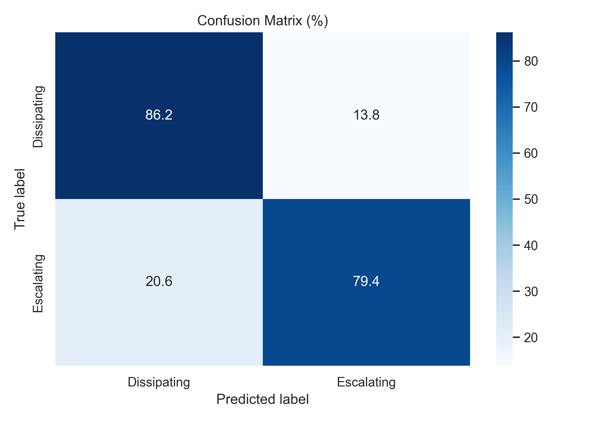
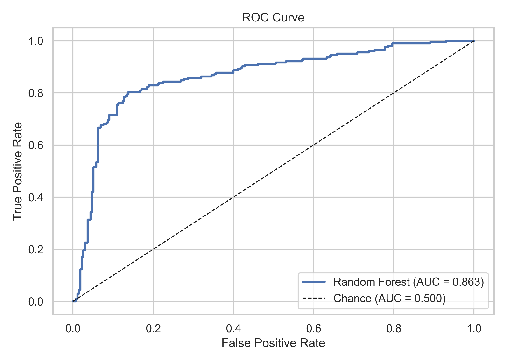
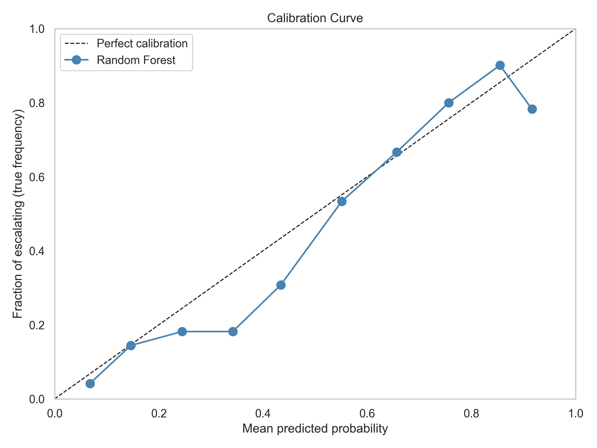
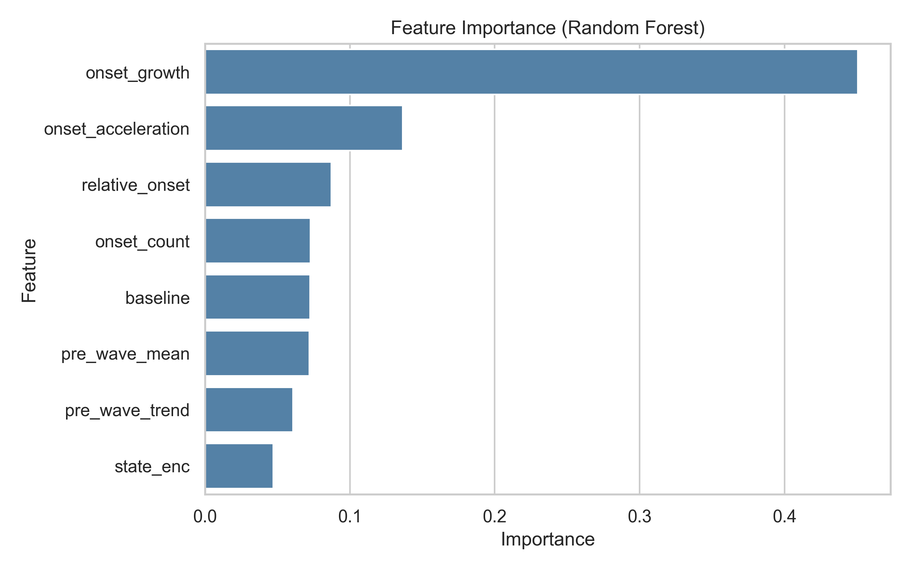

# Early Dynamics Predict Protest-Wave Escalation: An Evolutionary-Game-Theoretic Machine Learning Study with Spatial, Temporal, and Cross-National Validation

## Abstract
Forecasting whether protest waves escalate or dissipate is central to conflict monitoring and policy response. We propose a theory-informed prediction framework that combines evolutionary game theory and public goods logic with leakage-safe machine learning features from early wave dynamics. Using ACLED protest records for India (2016–2024), we build a district-week panel, detect protest waves with transparent rules, and predict escalation using onset-only information. The preferred model (Random Forest) achieves strong discrimination under stratified cross-validation (ROC-AUC = 0.866; accuracy = 0.833), with robust performance under district-grouped validation (ROC-AUC = 0.839) and temporal holdout (train 2016–2021, test 2022–2024; ROC-AUC = 0.859). Probability calibration is good (Brier score = 0.136). Theory-informed features substantially outperform simple baselines (AUC 0.866 vs. 0.673 for onset-count only). In cross-national transfer (train India, test Brazil), performance remains useful (ROC-AUC = 0.763; accuracy = 0.840). Overall, results indicate that early trajectory signals are informative for escalation forecasting and retain predictive value across space, time, and country context.

**Keywords:** protest forecasting, ACLED, escalation dynamics, machine learning, external validation, replicator dynamics

---

## 1. Introduction
Protest waves are episodic, spatially distributed, and often nonlinear in growth. A persistent challenge in conflict forecasting is to distinguish, early in a wave, between episodes that will escalate and those that will dissipate. Many forecasting pipelines prioritize predictive fit but underemphasize theoretical grounding, cross-context generalization, and leakage-safe design.

Our theoretical lens combines evolutionary game theory with a public goods perspective on collective action. Individuals decide whether to participate based on expected benefits, costs, and anticipated participation by others. Under this logic, participation can evolve through positive or negative feedback, and replicator-style dynamics imply that early changes in participation rate should be more informative than static counts. This motivates a trajectory-first prediction strategy.

This study addresses these gaps with three contributions. First, we operationalize an early-dynamics perspective: escalation depends more on trajectory than level. Second, we enforce leakage control by using onset-observable features only. Third, we evaluate model validity beyond standard cross-validation through district-grouped validation, temporal holdout, and cross-national transfer.

The paper proceeds as follows. Section 2 describes data construction and labeling. Section 3 presents modeling and validation design. Section 4 reports predictive, robustness, and transfer results. Section 5 discusses implications, limitations, and next steps.

Our core question is: **Can early wave dynamics reliably predict escalation, and does this signal generalize across space, time, and country context?**

### 1.1 Hypotheses
- **H1:** Early growth (`onset_growth`) is more predictive than initial magnitude (`onset_count`).
- **H2:** Adding early acceleration (`onset_acceleration`) improves predictive performance beyond growth-only.
- **H3:** A theory-informed classifier performs significantly better than chance.

---

## 2. Data and Study Design

### 2.1 Data source and scope
We use ACLED protest event records from 2016 to 2024.

- Total raw events: **175,236**
- India events (analysis set): **132,353**
- Unique India districts: **728**
- Active districts (>=50 events): **431**

Unit of analysis is **district-week**.

### 2.2 Panel construction
We build a complete district × week grid for active districts and merge observed event counts, assigning zeros for missing district-weeks. A robust sequential week index handles ISO-week boundaries.

### 2.3 Feature engineering
Features are computed on district-week trajectories:
- `growth_rate` (first difference of weekly counts)
- `acceleration` (difference of growth)
- rolling statistics and district baseline context

Theory-to-measurement mapping follows a reduced-form replicator intuition. In canonical form, participation dynamics can be written as $\frac{dx}{dt} = x(1-x)(B(x)-C(x))$, where participation in protest behaves like a strategic contribution to a public good. We do not estimate structural payoffs directly; instead, we operationalize this logic via early trajectory proxies (`onset_growth`, `onset_acceleration`) plus contextual baseline terms.

For final modeling, we use onset-only features extracted at wave onset:
1. `onset_count`
2. `onset_growth`
3. `onset_acceleration`
4. `relative_onset`
5. `pre_wave_mean`
6. `pre_wave_trend`
7. `baseline`
8. `state_enc`

### 2.4 Wave detection and labels
A wave is detected when all conditions hold:
1. weekly count > 5
2. weekly count > 1.5 × district baseline
3. duration >= 2 consecutive weeks

Labeling rule:
- escalating = 1 if peak occurs later in the episode (`peak_position > 0.4`)
- dissipating = 0 otherwise

Detected waves in India:
- Total waves: **479**
- Dissipating: **275**
- Escalating: **204**
- Escalating share: **0.426**

---

## 3. Methods

### 3.1 Models
We compare:
- Logistic Regression (`class_weight='balanced'`)
- Random Forest (`n_estimators=300`, `max_depth=6`, `class_weight='balanced'`)

### 3.2 Primary validation
Primary evaluation uses 5-fold stratified cross-validation with:
- Accuracy
- ROC-AUC

### 3.3 Robustness and generalization checks
1. **Grouped spatial validation:** GroupKFold by district
2. **Temporal forward holdout:** train 2016–2021, test 2022–2024
3. **Calibration:** reliability curve + Brier score
4. **Feature-set baselines:** compare theory-informed features to simple count baselines
5. **Label-threshold sensitivity:** alternate `peak_position` cutoffs (exploratory)
6. **External transfer:** train India, test Brazil

### 3.4 Statistical testing
- H1/H2 tested via cross-validated ROC-AUC differences
- H3 tested with permutation test (`n_permutations=200`) against chance

Scope note: this is a theory-informed predictive design rather than structural estimation of game parameters. Claims therefore concern predictive implications of evolutionary/public-goods dynamics, not direct recovery of latent utilities or equilibrium primitives.

---

## 4. Results

### 4.1 Main model performance (India)
| Model | Accuracy (mean) | ROC-AUC (mean) |
|---|---:|---:|
| Random baseline | 0.574 | 0.500 |
| Logistic Regression | 0.754 | 0.805 |
| Random Forest | **0.833** | **0.866** |

Interpretation: Random Forest substantially outperforms both baselines.

**Figure 1.** Cross-validated confusion matrix (row-normalized) for the Random Forest model. The classifier correctly identifies most dissipating waves and a substantial majority of escalating waves.

**Figure 2.** Receiver operating characteristic curve for the Random Forest model under cross-validated prediction. The area under the curve (AUC = 0.866) indicates strong discrimination between escalating and dissipating waves.

### 4.2 Hypothesis tests
| Hypothesis | Estimate 1 | Estimate 2 | Difference | Interpretation |
|---|---:|---:|---:|---|
| H1: `onset_growth` > `onset_count` (AUC) | 0.826 | 0.687 | **+0.139** | Supported |
| H2: growth+acceleration > growth-only (AUC) | 0.824 | 0.826 | -0.002 | Not supported |
| H3: RF AUC > chance | 0.866 | 0.500 | **+0.366** | Supported (p = 0.005) |

Interpretation: Early growth signal is the strongest theoretical result; acceleration adds limited incremental value in this specification.

### 4.3 Spatial and temporal robustness
| Validation scheme | Accuracy | ROC-AUC |
|---|---:|---:|
| Stratified CV (all India) | 0.833 | 0.866 |
| GroupKFold (new districts) | 0.808 | 0.839 |
| Temporal holdout (2022–2024) | 0.819 | 0.859 |

Interpretation: Performance declines modestly under harder tests, indicating genuine generalization rather than fold-specific overfit.

### 4.4 Calibration
- Brier score: **0.136**

Interpretation: Probabilistic outputs are reasonably calibrated and markedly better than naive uncertainty.

**Figure 3.** Calibration (reliability) curve for out-of-fold predicted probabilities. Predicted escalation probabilities track observed frequencies across bins, supporting probabilistic interpretability.

### 4.5 Feature-set value
| Feature set | ROC-AUC |
|---|---:|
| Onset count only | 0.673 |
| Onset + baseline + relative onset | 0.722 |
| Full theory-informed set | **0.866** |

Interpretation: Dynamics-informed features add large predictive value (gain of +0.193 AUC vs count-only).

**Figure 4.** Feature importance from the Random Forest model. `onset_growth` is the dominant predictor, consistent with the theory that early trajectory is more informative than initial magnitude.

### 4.6 External validity (India -> Brazil)
- Brazil waves: **25**
- Escalating share: **0.240**
- Accuracy: **0.840**
- ROC-AUC: **0.763**

Interpretation: Cross-national transfer shows expected performance attenuation but remains practically informative.

### 4.7 Label-threshold sensitivity (exploratory)
| Threshold (`peak_position`) | Positive share | Mean ROC-AUC | SD |
|---:|---:|---:|---:|
| 0.3 | 0.251 | 0.893 | 0.019 |
| 0.4 | 0.123 | 0.899 | 0.056 |
| 0.5 | 0.052 | 0.811 | 0.065 |
| 0.6 | 0.025 | 0.826 | 0.195 |

Interpretation: Signal persists, but higher thresholds create severe class imbalance and unstable variance. These checks are informative but should be treated as exploratory.

Across all result blocks, the same substantive pattern emerges: trajectory-sensitive onset features carry most predictive signal, and performance remains stable under stricter validation protocols.

---

## 5. Discussion
This study demonstrates that early protest-wave trajectory contains actionable predictive information. The main finding is consistent across three dimensions of validity: internal (stratified CV), spatial (district-grouped CV), and temporal (future holdout). External transfer to Brazil further suggests that part of the learned structure is portable across country contexts.

The strongest substantive contribution is the performance gain of trajectory-sensitive features over count-only baselines. This supports a dynamic interpretation of escalation risk: early directional momentum matters more than initial level. Interpreted through an evolutionary public goods lens, this pattern is consistent with strategic reinforcement in collective participation during early wave formation.

At the same time, several constraints remain. First, Brazil external testing is based on a small number of waves (n=25), which limits precision. Second, label construction depends on a chosen peak-position threshold. Third, despite transfer success, country-specific reporting and event-generation processes may still introduce domain shift.

Overall, results support a measured conclusion: the framework is robust enough for applied forecasting support, while broader multi-country replication is still needed for stronger external claims. Importantly, findings should be interpreted as evidence for theory-consistent predictive structure, not as a full structural test of evolutionary game models.

---

## 6. Conclusion
A leakage-safe, theory-informed ML pipeline can predict protest-wave escalation with high discrimination and stable generalization. In India, Random Forest reaches ROC-AUC 0.866; under stricter spatial and temporal tests, performance remains high (0.839–0.859). Cross-national transfer to Brazil (AUC 0.763) indicates useful external signal retention.

For practice, the model can support early-warning triage by prioritizing waves with high escalation risk. For research, next steps include larger cross-country panels, richer domain-adaptation designs, and tighter uncertainty reporting under severe class imbalance.

---

## 7. Reproducibility Statement
All analyses were executed in the project notebook, and outputs were exported to `paper_outputs`.

Core artifacts include:
- model performance tables
- robustness and temporal validation tables
- baseline comparison and sensitivity tables
- confusion matrix, ROC, feature-importance, and calibration figures

---

## 8. Ethics and Use Considerations
This model is intended for aggregate risk assessment, not individual-level targeting. Forecasts should be interpreted as probabilistic support tools and combined with contextual expertise.

---

## 9. References (to finalize in journal format)
- ACLED documentation and data methodology.
- Conflict/protest forecasting studies using ACLED and machine learning.
- Calibration and probabilistic forecasting references.
- Cross-validation methodology, including grouped and temporal validation.

> Note: Insert complete bibliographic entries in the target journal style (e.g., APA/Chicago/Harvard) from your citation manager before submission.

---

## Appendix A. Key Reported Metrics (for quick copy)
- India (stratified CV): AUC 0.866 ± 0.036, Accuracy 0.833 ± 0.028
- GroupKFold (district): AUC 0.839 ± 0.059, Accuracy 0.808 ± 0.043
- Temporal holdout: AUC 0.859, Accuracy 0.819
- Calibration: Brier 0.136
- Baseline AUCs: 0.673 (count), 0.722 (normalized), 0.866 (full)
- Brazil transfer: AUC 0.763, Accuracy 0.840, N=25 waves
- H3 permutation p-value: 0.005
